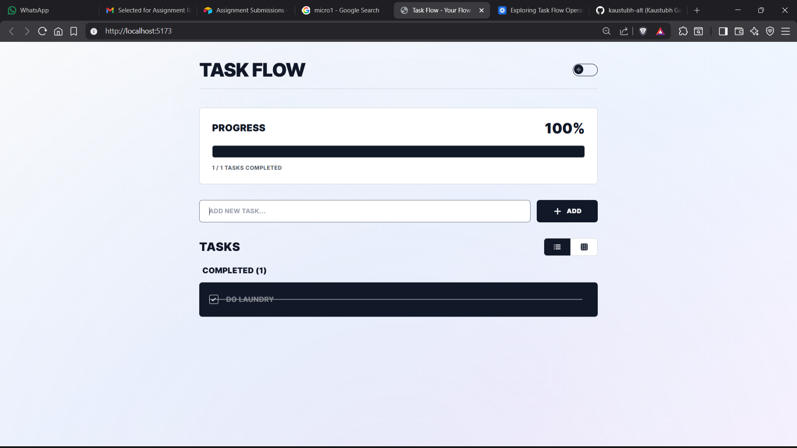
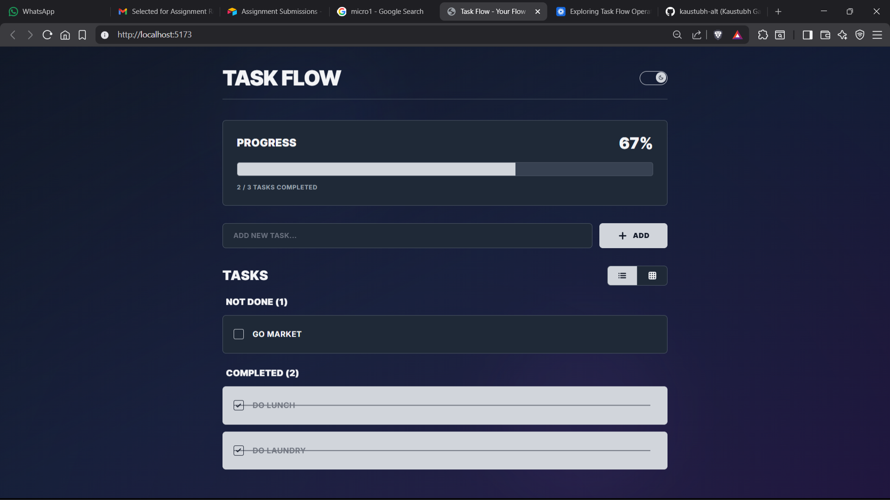
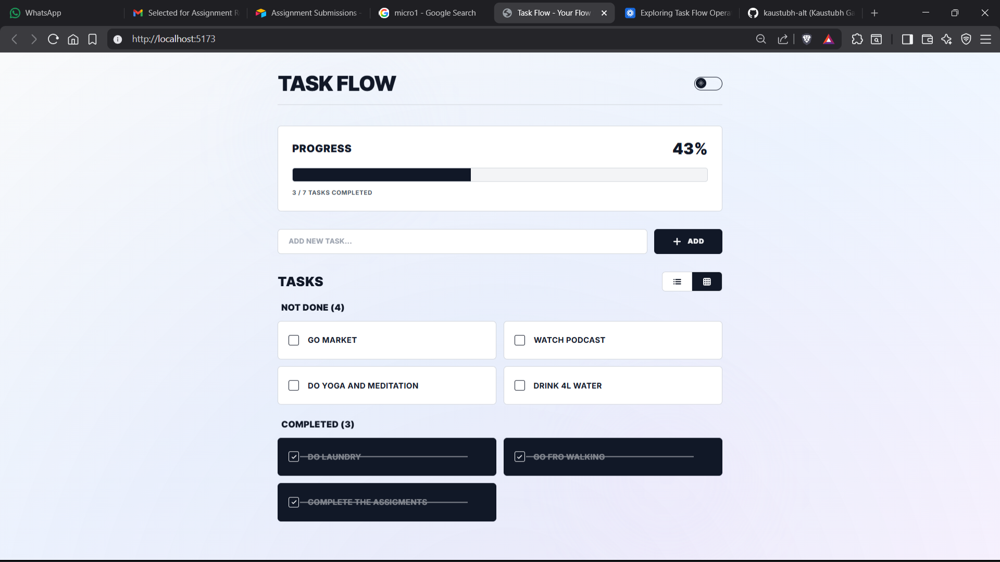

# Task Flow

A modern, elegant task management application with a professional UI design. Built with FastAPI backend and React frontend, featuring dark mode, animated backgrounds, and smooth transitions.


## 📋 About

Task Flow is a full-stack task management application designed with a focus on aesthetics and user experience. It features a clean, professional interface with:

- **Elegant Design**: Thin borders, subtle curves, and smooth animations
- **Dark Mode**: Fully functional theme switching with persistent storage
- **Task Organization**: Automatic categorization into "Not Done" and "Completed" sections
- **Animated Backgrounds**: Gradient backgrounds with floating orbs for visual interest
- **Responsive Layout**: Works beautifully on desktop and mobile devices
- **View Modes**: Toggle between List and Card layouts

## ✨ ScreenShots





## ✨ Features

### Core Functionality
- ✅ Create, complete, and delete tasks
- ✅ Real-time progress tracking with visual progress bar
- ✅ Task categorization (Not Done / Completed)
- ✅ Persistent dark mode preference

### UI/UX Highlights
- 🎨 Professional 2D design with elegant borders
- 🌓 Dark mode with optimized color contrast
- ✂️ Cut animation for completed tasks
- 🎭 Smooth transitions and hover effects
- 📱 Responsive grid and list views
- 🎪 Animated gradient background

## 🛠️ Tech Stack

### Backend
- **FastAPI** - Modern Python web framework
- **Uvicorn** - ASGI server
- **Pydantic** - Data validation

### Frontend
- **React 18** - UI library
- **Vite** - Build tool and dev server
- **Tailwind CSS** - Utility-first CSS framework
- **Lucide React** - Icon library

## 📦 Installation

### Prerequisites
- Python 3.8 or higher
- Node.js 18 or higher
- npm or yarn

### Backend Setup

1. Navigate to the project directory:
```bash
cd todo
```

2. Install Python dependencies:
```bash
pip install -r requirements.txt
```

### Frontend Setup

1. Install Node.js dependencies:
```bash
npm install
```

## 🚀 Running the Application

### Start the Backend Server

```bash
python -m uvicorn main:app --reload
```

The backend API will be available at `http://localhost:8000`

### Start the Frontend Development Server

In a separate terminal:

```bash
npm run dev
```

The frontend will be available at `http://localhost:5173`

### Access the Application

Open your browser and navigate to:
```
http://localhost:5173
```

## 📁 Project Structure

```
todo/
├── main.py                 # FastAPI backend
├── requirements.txt        # Python dependencies
├── package.json           # Node.js dependencies
├── vite.config.js         # Vite configuration
├── tailwind.config.js     # Tailwind CSS configuration
├── postcss.config.js      # PostCSS configuration
├── index.html             # HTML entry point
└── src/
    ├── main.jsx           # React entry point
    ├── index.css          # Global styles & animations
    └── App.jsx            # Main application component
```

## 🎨 Components & Features

### Backend Components (`main.py`)

#### API Endpoints
- `GET /tasks` - Retrieve all tasks
- `POST /tasks` - Create a new task
- `PUT /tasks/{id}/toggle` - Toggle task completion status
- `DELETE /tasks/{id}` - Delete a task

#### Data Models
- **TaskCreate** - Pydantic model for task creation
- **Task** - Pydantic model for task representation

#### Features
- CORS middleware enabled for all origins
- In-memory task storage (runtime persistence)
- Auto-incrementing task IDs
- Error handling for invalid task IDs

### Frontend Components (`src/App.jsx`)

#### Main Features
1. **Header**
   - App title with bold typography
   - Dark mode toggle switch

2. **Progress Section**
   - Visual progress bar
   - Percentage display
   - Task completion counter

3. **Input Area**
   - Task input field
   - Add button with rotation animation

4. **View Switcher**
   - List view button
   - Card view button
   - Smooth transition between views

5. **Task List**
   - Categorized sections (Not Done / Completed)
   - Custom checkboxes
   - Cut animation for completed tasks
   - Hover-to-reveal delete buttons
   - Fade-in animation with staggered delays

#### Styling Features (`src/index.css`)
- Custom scrollbar styling
- Fade-in animations
- Cut text animation for completed tasks
- Pulse animation for background orbs
- Smooth color transitions

## 🎯 Usage

1. **Add a Task**: Type in the input field and click "ADD" or press Enter
2. **Complete a Task**: Click the checkbox next to a task
3. **Delete a Task**: Hover over a task and click the X button
4. **Toggle Dark Mode**: Click the moon/sun icon in the header
5. **Switch Views**: Click the List or Grid icon to change layout

## 🎨 Design Philosophy

Task Flow follows a professional, elegant design approach:

- **Thin Elegant Borders**: 2px borders for a refined look
- **Subtle Curves**: Rounded corners for modern aesthetics
- **2D Design**: Clean, flat design with depth through shadows
- **Color Contrast**: Optimized for both light and dark modes
- **Smooth Animations**: All interactions are animated for fluidity
- **Visual Feedback**: Hover states and transitions provide clear feedback

## 🌙 Dark Mode

Dark mode features improved color contrast:
- **Unchecked Tasks**: Gray-800 background with light text
- **Checked Tasks**: Gray-300 background with dark cut text
- **Borders**: Gray-600 for clear differentiation
- **Background**: Dark gradient with subtle animated orbs

## 📝 License

This project is open source and available for personal and commercial use.

## 🤝 Contributing

Contributions, issues, and feature requests are welcome!

## 👨‍💻 Author

Built with ❤️ using modern web technologies

---

**Enjoy managing your tasks with style!** ✨


